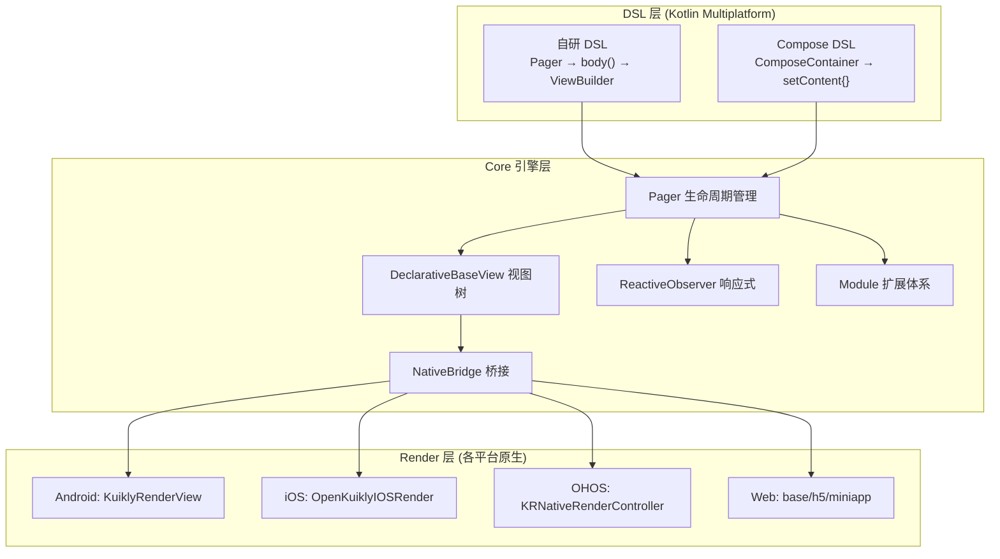

# KuiklyUI 架构详解

> 以下场景读取本文件：需要修改 `core-render-*`、`buildSrc`、`core-ksp` 等 AGENTS.md 未覆盖的目录；确认新代码应放哪个模块；理解模块间依赖关系；修改框架核心层（Pager 生命周期、ReactiveObserver、NativeBridge、KuiklyApplier）时。

## 三层架构



---

## 1. 顶层目录结构

```
KuiklyUI/
├── .ai/                        # AI 知识库
├── AGENTS.md / CLAUDE.md       # AI 入口配置
├── README.md / README-zh_CN.md # 项目文档
│
├── core/                       # [KMP] 跨平台核心模块
├── core-annotations/           # [KMP] 注解定义（@Page 等）
├── core-ksp/                   # [JVM] KSP 注解处理器
├── core-render-android/        # [Android] 原生渲染器
├── core-render-ios/            # [iOS/ObjC] 原生渲染器（非 Gradle，CocoaPods/SPM）
├── core-render-ohos/           # [HarmonyOS/C++/ETS] 原生渲染器（非 Gradle，hvigor）
├── core-render-web/            # [Kotlin/JS] Web 渲染器
│   ├── base/                   #   基础渲染层
│   ├── h5/                     #   H5 实现
│   └── miniapp/                #   小程序实现
├── compose/                    # [KMP] Compose UI 层（fork 自 JetBrains Compose 1.7.3）
├── demo/                       # [KMP] 示例代码
│
├── androidApp/                 # Android 宿主壳工程
├── iosApp/                     # iOS 宿主壳工程（Xcode + CocoaPods）
├── ohosApp/                    # HarmonyOS 宿主壳工程（DevEco Studio）
├── macApp/                     # macOS 宿主壳工程
├── h5App/                      # H5 宿主壳工程
├── miniApp/                    # 小程序宿主壳工程
│
├── docs/                       # 对外官网文档（非 AI 知识库）
├── buildSrc/                   # Gradle 构建脚本、版本管理
├── publish/                    # 发布脚本
├── test/                       # 测试
└── settings.gradle.kts         # 主 Gradle 设置（默认 Kotlin 2.1.21）
```

## 2. Gradle 模块列表

| 模块路径 | 类型 | 说明 |
|---------|------|------|
| `:core` | KMP 多平台库 | 核心框架 |
| `:core-annotations` | KMP 多平台库 | 注解定义 |
| `:core-ksp` | JVM 库 | KSP 注解处理器 |
| `:core-render-android` | Android 库 | Android 原生渲染器 |
| `:core-render-web:base` | Kotlin/JS 库 | Web 渲染基础层 |
| `:core-render-web:h5` | Kotlin/JS 库 | H5 渲染实现 |
| `:core-render-web:miniapp` | Kotlin/JS 库 | 小程序渲染实现 |
| `:compose` | KMP 多平台库 | Compose UI 层 |
| `:demo` | KMP 多平台库 | 示例代码 |
| `:androidApp` | Android App | Android 宿主壳 |
| `:h5App` | Kotlin/JS App | H5 宿主壳 |
| `:miniApp` | Kotlin/JS App | 小程序宿主壳 |

**注意**：`core-render-ios`（ObjC, CocoaPods/SPM）和 `core-render-ohos`（hvigor）不是 Gradle 模块。

## 3. core/ 内部结构

```
core/src/
├── commonMain/kotlin/com/tencent/kuikly/core/
│   ├── base/               # 基础视图体系：AbstractBaseView, DeclarativeBaseView, Attr, RenderView
│   │   ├── attr/           # 属性接口：ILayoutAttr, IStyleAttr, IImageAttr, IEventCaptureAttr
│   │   └── event/          # 事件：BaseEvent, Event, EventName, EventParams, FrameEvent
│   ├── collection/         # 高性能集合（FastCollect 等）
│   ├── coroutines/         # 跨平台协程封装
│   ├── directives/         # 模板指令：条件渲染(v-if), 循环渲染(v-for), 懒加载循环
│   ├── layout/             # 布局引擎：FlexLayout, FlexNode, FlexStyle, LayoutImpl
│   ├── manager/            # 管理器：BridgeManager, PagerManager, TaskManager
│   ├── module/             # 模块系统：Network, Router, Font, Calendar 等 17 个模块
│   ├── nvi/                # Native Bridge 接口 + JSON 序列化
│   ├── pager/              # 页面系统：IPager, Pager, PagerData, 生命周期
│   ├── reactive/           # 响应式：ObservableProperty, ReactiveObserver
│   ├── views/              # 内置视图组件（30+ 个）
│   │   ├── DivView, TextView, ImageView, InputView, ListView, ScrollerView...
│   │   ├── layout/         # 布局视图：RowView, ColumnView, CenterView
│   │   └── compose/        # Compose 桥接视图
│   └── (utils, timer, log, reflection, exception, datetime, global)
│
├── androidMain/            # Android 平台 actual 实现（8 文件）
├── appleMain/              # Apple(iOS+macOS) 平台 actual 实现（7 文件）
├── ohosArm64Main/          # HarmonyOS 平台 actual 实现（8 文件）
├── jsMain/                 # JS(H5+小程序) 平台 actual 实现（13 文件）
└── jvmMain/                # 纯 JVM 平台 actual 实现（6 文件）
```

## 4. compose/ 内部结构

```
compose/src/commonMain/kotlin/com/tencent/kuikly/compose/
├── ComposeContainer.kt          # Compose 页面容器（继承 Pager）
├── ComposeSceneMediator.kt      # Compose 场景调度器
├── KuiklyApplier.kt             # Compose→Kuikly 节点映射
├── animation/                   # 动画系统
│   └── core/                    # 动画核心引擎
├── foundation/                  # Foundation 组件（fork 自 Compose Foundation）
│   ├── gestures/                # 手势系统
│   ├── lazy/                    # LazyColumn/LazyRow/LazyGrid
│   ├── pager/                   # HorizontalPager/VerticalPager
│   ├── text/                    # Text/TextField
│   └── (Background, Border, Canvas, Clickable, Image, Scroll...)
├── material3/                   # Material3 组件（fork 自 Compose Material3）
│   ├── AppBar, Button, Card, Checkbox, TextField, Switch, Tab...
│   ├── Scaffold, ModalBottomSheet, Snackbar, ProgressIndicator...
│   └── MaterialTheme, ColorScheme, Typography, Shapes
├── ui/                          # UI 核心（fork 自 Compose UI）
│   ├── layout/                  # 布局系统（Measurable, Placeable, MeasurePolicy 等 32 文件）
│   ├── draw/, focus/, graphics/, input/, modifier/, node/
│   ├── semantics/, state/, text/, unit/, window/
│   └── Modifier.kt, Alignment.kt
└── (coil3, container, coroutines, extension, gestures, views)
```

## 5. 各平台渲染器内部结构

### core-render-android/

```
src/main/java/com/tencent/kuikly/core/render/android/
├── KuiklyRenderView.kt          # 渲染视图入口
├── core/                        # KuiklyRenderCore
├── context/                     # JVM/Common/ExecuteMode
├── scheduler/                   # UI 调度器/Context 调度器
├── css/                         # CSS 属性处理
│   ├── animation/               # 动画：Plain/Spring/CSS
│   ├── gesture/                 # 手势检测
│   └── drawable/, decoration/   # 背景/装饰
├── expand/
│   ├── component/               # KRImageView, KRRichTextView, KRCanvasView 等
│   └── module/                  # 16 个原生模块
├── adapter/                     # 12 个适配器接口（Image, Router, Font, Log 等）
└── performance/                 # 帧率/启动/内存监控
```

### core-render-ios/ (ObjC)

```
├── Core/                   # KuiklyRenderCore, UIScheduler
├── View/                   # KuiklyRenderView
├── Protocol/               # 协议接口
├── Extension/
│   ├── Components/         # KRView, KRImageView, KRListView 等 + NestScroll
│   └── Modules/            # 15 个原生模块
├── Performance/            # 性能监控
└── MacSupport/             # macOS 兼容
```

### core-render-ohos/ (C++ + ETS)

```
src/main/
├── cpp/                    # C++ Native 交互层
└── ets/                    # ArkTS/ETS 层
    ├── KRNativeRenderController.ets  # 入口
    ├── components/, modules/, adapter/, context/, foundation/
    └── native/, manager/, utils/
```

### core-render-web/ (Kotlin/JS)

```
base/src/jsMain/  — 基础渲染层（components + modules + adapter + processor）
h5/               — H5 专用（ListView, NestScroll, KuiklyView）
miniapp/          — 小程序专用（MiniDocument, MiniGlobal, EventManage）
```
