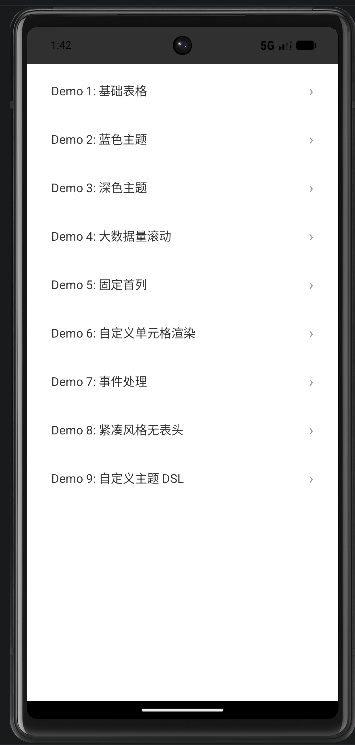
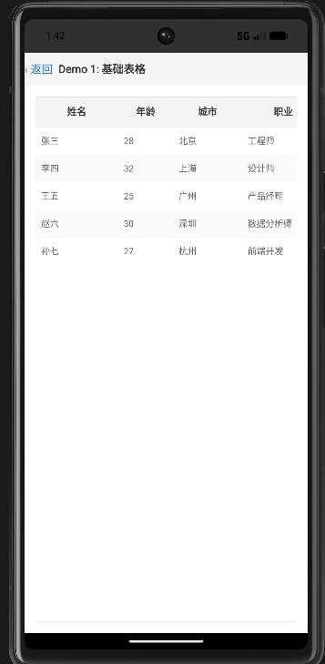
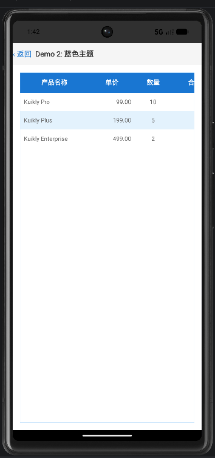
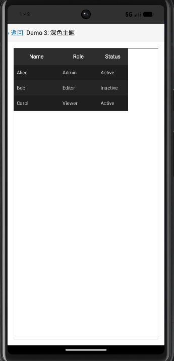
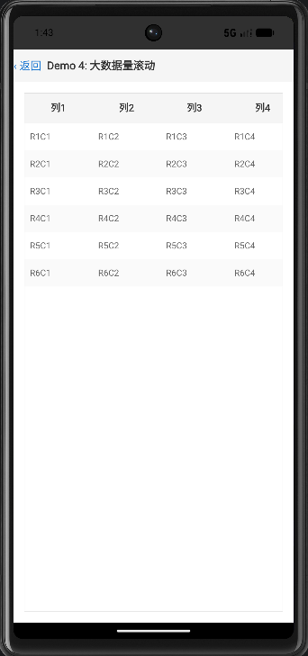
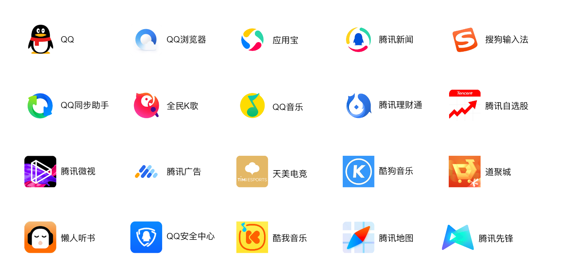

<<<<<<< HEAD
# KuiklyTableUI

基于 [Kuikly](https://kuikly.tds.qq.com) 跨平台框架开发的表格组件，组件源码位于 `shared/src/commonMain`，Android / iOS 共用同一份代码。

## 功能特性

- 多行多列数据展示
- 横纵双向滚动，支持大数据量（固定列 + 嵌套 ScrollerView，数据量大时建议配合固定列使用）
- 斑马纹、行/列/外边框、内边距、对齐等样式配置
- 固定列（冻结列）支持，左右面板滚动联动
- 自定义表格主题（内置 DEFAULT / DARK / COMPACT / BLUE 四套预设，亦可用 DSL 自定义）
- 单元格自定义渲染（在单元格内嵌入任意 Kuikly 组件）
- 简洁的 DSL 语法（`Table { ... }`）
- 事件系统：单元格点击 / 行点击 / 表头点击 / 滚动
- 跨平台支持（Android / iOS，共用同一份 `commonMain` 代码）

## API 文档

组件以 Kuikly DSL 形式提供，核心入口为 `Table { }`，可在任意 `ViewContainer` 中直接使用。所有 API 位于 `com.kuikly.table` 包及其子包（`dsl` / `model`）。

### 1. 快速开始

```kotlin
Table {
    column("name", "姓名", 120f)
    column("age", "年龄", 80f)
    column("city", "城市", 100f)

    row("张三", "28", "北京")
    row("李四", "32", "上海")
}
```

### 2. 表格构建器 `TableBuilder`

`Table { }` 的接收者为 `TableBuilder`，可用方法如下：

| 方法 | 说明 |
|------|------|
| `column(key, title, width = 100f, block = {})` | 定义一列；`block` 为 `ColumnBuilder` 作用域，可进一步配置对齐 / 固定 / 自定义渲染等 |
| `columns(vararg cols: ColumnDef)` | 批量添加已构建的列定义 |
| `row(vararg values: String)` | 添加一行数据（按列顺序） |
| `rows(data: List<List<String>>)` | 一次性设置全部行数据 |
| `data(tableData: TableData)` | 绑定 `TableData` 模型（同时设置列、行、表头可见性、固定列数） |
| `theme(theme: TableTheme)` | 套用预设主题（`DEFAULT` / `DARK` / `COMPACT` / `BLUE`） |
| `theme(block: ThemeBuilder.() -> Unit)` | 内联自定义主题 |
| `headerVisible(visible: Boolean)` | 是否显示表头，默认 `true` |
| `fixedColumns(count: Int)` | 冻结列数量（左冻结），默认 `0`；超过总列数时自动钳位 |
| `maxHeight(height: Float)` | 设置最大高度；超出后启用内部纵向滚动，不设置则按内容自然撑开 |
| `scrollEnabled(enabled: Boolean)` | 是否启用横纵滚动，默认 `true` |

**事件回调**

| 方法 | 回调签名 | 说明 |
|------|----------|------|
| `onCellClick { }` | `(rowIndex: Int, colIndex: Int, value: String) -> Unit` | 单元格点击 |
| `onRowClick { }` | `(rowIndex: Int) -> Unit` | 整行点击 |
| `onHeaderClick { }` | `(colIndex: Int, columnKey: String) -> Unit` | 表头点击 |
| `onScroll { }` | `(offsetX: Float, offsetY: Float) -> Unit` | 滚动（不打印日志，避免高频刷屏） |

> 注：`onCellClick` / `onRowClick` / `onHeaderClick` 由 `TableEvent` 实现，内部会自动打印交互日志（`TableLog.interaction`），再分发到你的 handler。

### 3. 列定义 `ColumnBuilder` 与 `ColumnDef`

`column(...)` 内部通过 `ColumnBuilder` 配置，最终生成 `ColumnDef` 数据类：

```kotlin
data class ColumnDef(
    val key: String,
    val title: String,
    val width: Float = 100f,
    val minWidth: Float = 50f,
    val align: TextAlign = TextAlign.LEFT,
    val headerAlign: TextAlign = TextAlign.CENTER,
    val fixed: Boolean = false,
    val customRenderer: CellRendererScope? = null
)
```

`ColumnBuilder` 可用配置：

| 方法 | 说明 |
|------|------|
| `width(w: Float)` | 列宽 |
| `minWidth(w: Float)` | 最小列宽，默认 `50f` |
| `align(a: TextAlign)` | 单元格内容对齐，默认 `LEFT` |
| `headerAlign(a: TextAlign)` | 表头对齐，默认 `CENTER` |
| `fixed(f: Boolean)` | 是否冻结该列 |
| `customRenderer(renderer)` | 自定义单元格渲染器（见第 5 节） |

### 4. 主题 `TableTheme`

内置四套预设：

```kotlin
TableTheme.DEFAULT   // 默认浅色
TableTheme.DARK      // 深色
TableTheme.COMPACT   // 紧凑（更小的行高 / 字号）
TableTheme.BLUE      // 蓝色表头
```

自定义主题通过 `ThemeBuilder` 配置（所有字段均可选，带默认值）：

| 字段 | 默认值 | 说明 |
|------|--------|------|
| `headerBackgroundColor` | `0xFFF5F5F5` | 表头背景色 |
| `headerTextColor` | `0xFF333333` | 表头文字色 |
| `headerFontSize` | `14f` | 表头字号 |
| `headerFontBold` | `true` | 表头是否加粗 |
| `headerHeight` | `44f` | 表头高度 |
| `rowHeight` | `40f` | 行高 |
| `rowBackgroundColor` | `0xFFFFFFFF` | 奇数行背景 |
| `rowAlternateColor` | `0xFFFAFAFA` | 偶数行背景（斑马纹） |
| `cellTextColor` | `0xFF666666` | 单元格文字色 |
| `cellFontSize` | `13f` | 单元格字号 |
| `cellPaddingHorizontal` | `8f` | 单元格水平内边距 |
| `cellPaddingVertical` | `4f` | 单元格垂直内边距 |
| `borderColor` | `0xFFE0E0E0` | 边框颜色 |
| `borderWidth` | `0.5f` | 边框线宽 |
| `showRowBorder` | `true` | 显示行底边框 |
| `showColumnBorder` | `true` | 显示列右边框 |
| `showOuterBorder` | `true` | 显示外边框 |
| `stripedRows` | `true` | 斑马纹（奇偶行交替底色） |

### 5. 自定义单元格渲染 `CellRendererScope`

`customRenderer` 接收一个扩展函数，可在单元格内嵌入任意 Kuikly 组件（`View{}` / `Text{}` 等）：

```kotlin
typealias CellRendererScope =
    ViewContainer<*, *>.(cellData: CellData, rowIndex: Int, colIndex: Int) -> Unit
```

示例（状态标签 + 星级评分来自 `DemoTables.kt`）：

```kotlin
Table {
    column("name", "姓名", 100f)
    column("status", "状态", 100f) {
        align(TextAlign.CENTER)
        customRenderer { cellData, _, _ ->
            // cellData: CellData(rowIndex, colIndex, value, columnKey, extra)
            View {
                attr {
                    backgroundColor(if (cellData.value == "在线") 0xFF4CAF50 else 0xFFF44336)
                    borderRadius(12f)
                    padding(8f, 2f, 8f, 2f)
                }
                Text { attr { text(cellData.value); color(0xFFFFFFFF); fontSize(12f) } }
            }
        }
    }
    row("张三", "在线")
    row("李四", "离线")
}
```

`CellData` 结构：`data class CellData(val rowIndex: Int, val colIndex: Int, val value: String, val columnKey: String = "", val extra: Map<String, Any>? = null)`

### 6. 数据模型（可选）

若不写死 `row(...)`，可构造 `TableData` 后通过 `data(tableData)` 绑定：

```kotlin
data class TableData(
    val columns: List<ColumnDef>,
    val rows: List<List<String>>,
    val headerVisible: Boolean = true,
    val fixedColumns: Int = 0
)
```

`TableData` 额外提供 `getCellData(rowIndex, colIndex): CellData` 以及 `totalWidth` / `fixedWidth` / `scrollableWidth` 宽度计算属性；`TableAttr` 同样提供 `totalWidth` / `fixedWidth` / `scrollableWidth`。

### 7. 对齐枚举 `TextAlign`

```kotlin
enum class TextAlign { LEFT, CENTER, RIGHT }
```

## 每个文件的功能

### 工程配置
| 文件 | 功能 |
|------|------|
| `settings.gradle.kts` | Gradle 根配置，注册 `:shared` / `:androidApp` 模块 |
| `build.gradle.kts` | 根工程，统一插件版本 |
| `gradle.properties` | Gradle 全局属性（JVM 参数等） |
| `gradlew` / `gradlew.bat` | Gradle Wrapper 脚本（macOS/Linux 与 Windows） |
| `gradle/wrapper/` | Wrapper 可执行 jar 与分发配置（Gradle 8.4） |
| `.github/workflows/ci.yml` | GitHub Actions 双平台 CI：Android（Ubuntu）+ iOS（macOS） |
| `shared/shared.podspec` | CocoaPods 配置，供 iOS 以本地 pod 集成 `shared` |
| `iosApp/Podfile` | iOS 依赖（OpenKuiklyIOSRender ~> 2.15.0 + SDWebImage） |

### shared（KMP 共享模块，组件核心）

**commonMain（跨平台核心）**
| 文件 | 功能 |
|------|------|
| `KuiklyTableView.kt` | 表格主组件（ComposeView），负责整体渲染与滚动布局 |
| `TableAttr.kt` | 表格属性定义（列/行/主题/边框/滚动等） |
| `TableEvent.kt` | 事件定义（单元格点击 / 行点击 / 表头点击 / 滚动） |
| `model/ColumnDef.kt` | 列定义（key/title/width/customRenderer） |
| `model/CellData.kt` | 单元格数据 |
| `model/TableData.kt` | 表格数据容器 |
| `model/TableTheme.kt` | 主题模型，内置 DEFAULT / DARK / COMPACT / BLUE 预设 |
| `model/TextAlign.kt` | 对齐枚举 |
| `dsl/TableDsl.kt` | DSL 入口 `Table { }`，提供 column/row/theme 等链式 API |
| `log/TableLogger.kt` | 日志模块 `expect` 声明（跨平台接口） |
| `demo/TableDemoPage.kt` | 演示入口列表页，`@Page("tableDemo")` |
| `demo/DemoTables.kt` | 9 个表格示例的 DSL 配置（复用） |
| `demo/DemoPages.kt` | 独立演示页 `tableDemo1`~`tableDemo9`（`@Page` 注册） |

**androidMain / iosMain（平台实现）**
| 文件 | 功能 |
|------|------|
| `androidMain/.../log/TableLogger.android.kt` | 日志模块 `actual`（Android，JVM `synchronized` 加锁） |
| `iosMain/.../log/TableLogger.ios.kt` | 日志模块 `actual`（iOS，Foundation C interop） |

**commonTest（单元测试）**
| 文件 | 功能 |
|------|------|
| `TableAttrTest.kt` / `TableEventTest.kt` | 属性 / 事件测试 |
| `dsl/TableDslTest.kt` | DSL 测试 |
| `model/CellDataTest.kt`、`ColumnDefTest.kt`、`TableDataTest.kt`、`TableThemeTest.kt`、`TextAlignTest.kt` | 模型测试 |

### androidApp（Android 宿主，可直接运行）
| 文件 | 功能 |
|------|------|
| `build.gradle.kts` | Android 应用配置 |
| `AndroidManifest.xml` | 清单（注册宿主 Activity、网络配置） |
| `KRApplication.kt` | Application，调用 `KuiklyCoreEntry.triggerRegisterPages()` 注册页面 |
| `KuiklyRenderActivity.kt` | Kuikly 渲染宿主 Activity |
| `adapter/KRImageAdapter.kt` | 图片适配器 |
| `adapter/KRLogAdapter.kt` | 日志适配器 |
| `adapter/KRRouterAdapter.kt` | 路由适配器（object） |
| `adapter/KRThreadAdapter.kt` | 线程适配器 |
| `adapter/KRUncaughtExceptionHandlerAdapter.kt` | 未捕获异常适配器 |
| `res/layout/activity_hr.xml` | 宿主布局 |
| `res/values/styles.xml` | 样式 |
| `res/xml/network_security_config.xml` | 网络安全配置 |

### iosApp（iOS 宿主，macOS 验证）
| 文件 | 功能 |
|------|------|
| `iosApp.xcodeproj/project.pbxproj` | Xcode 工程配置 |
| `iosApp.xcworkspace/` | 工作区（含 CocoaPods） |
| `Info.plist` | 应用配置 |
| `iOSApp.swift` | App 入口 |
| `ContentView.swift` | 内容视图（承载 Kuikly 页面） |
| `KuiklyRenderViewPage.swift` | Kuikly 渲染页 |
| `iosApp-Bridging-Header.h` | ObjC / Swift 桥接头 |
| `KuiklyExpand/KuiklyRenderViewController.h/.m` | Kuikly 渲染视图控制器 |
| `KuiklyExpand/Handler/KRRouterHandler.h/.m` | 路由处理器 |
| `KuiklyExpand/Handler/KuiklyRenderComponentExpandHandler.h/.m` | 组件扩展处理器 |
| `KuiklyExpand/Modules/HRBridgeModule.h/.m` | 桥接模块 |
| `FDFullscreenPopGesture/` | 全屏手势返回（第三方） |
| `Assets.xcassets/` | 图标 / 色彩资源 |

## 验证情况

| 验证项 | 环境 | 结果 |
|--------|------|------|
| Android 实机运行 | Android Studio 模拟器 API 37.1 / Android 17（x86_64） | ✅ 通过 |
| 单元测试 | `./gradlew :shared:testDebugUnitTest`（8 个测试文件） | ✅ 通过 |
| iOS 编译验证 | GitHub Actions macOS runner（Kotlin/Native 框架 + Xcode 模拟器编译） | ✅ 通过 |

- **Android**：点击 `tableDemo` 列表进入 9 个独立演示页，确认基础表格、四套主题、斑马纹、横纵双向滚动、固定列、自定义渲染、事件回调均正常渲染。
- **iOS**：因仅有 Windows 电脑无 Mac，**运行时未做验证**；仅通过 CI 在 macOS 上完成**编译验证**（`:shared` Kotlin/Native 框架编译 + Xcode 模拟器架构编译 `iosApp` 宿主，均 BUILD SUCCESSFUL）。

## 验证截图

以下为 Android Studio 模拟器（API 37.1 / Android 17）实测截图：

| Demo 列表 | 基础表格 | 蓝色主题 |
|:---------:|:--------:|:--------:|
|  |  |  |

| 深色主题 | 大数据量滚动 |
|:--------:|:------------:|
|  |  |
=======

<p align="center">
    
</p>

<p align="center">

[](https://github.com/Tencent-TDS/KuiklyUI/releases)
[](https://github.com/Tencent-TDS/KuiklyUI/blob/main/LICENSE)
[](https://kotlinlang.org)
[](https://github.com/Tencent-TDS/KuiklyUI)
[](https://github.com/Tencent-TDS/KuiklyUI/pulls)

</p>

English | [简体中文](./README-zh_CN.md) | [Homepage](https://framework.tds.qq.com/)


## Introduction
`Kuikly` is a comprehensive cross-platform solution for UI and logic based on Kotlin multi-platform. It was launched by Tencent's company-level Oteam in the front-end field. It aims to provide a `high-performance, full-platform development framework with unified codebase, ultimate ease of use, and dynamic flexibility`. Currently supported platforms:
- [X] Android
- [X] iOS
- [X] HarmonyOS
- [X] Web (Beta)
- [X] Mini Programs (Beta)
- [X] macOS (Alpha)

Since its launch, `Kuikly` has gained wide recognition from the business. It has been used by many products such as QQ, QQ Music, QQ Browser, Tencent News, Sogou Input Method, MyApp Hub(Tencent's app store), WeSing, Kugou Music, Kuwo Music, Tencent Self-selected Stock, ima.copilot, Weishi, etc.
## Key Features

- **Cross-platform:** Kotlin-based implementation ensuring consistent operation across multiple platforms - one codebase, six platforms
- **Native performance:** Generates platform-native binaries (.aar/.framework/.so)
- **Native development experience:** Native UI rendering, native toolchain support, Kotlin as primary language
- **Lightweight:** Minimal SDK footprint (AOT mode: ~300KB for Android, ~1.2MB for iOS)
- **Dynamic capability:** Supports compilation into dynamic deliverables
- **Multiple paradigms:** Supports both declarative & reactive programming, with self-developed DSL and Compose DSL

## Project Structure

```shell
.
├── core                    # Cross-platform module implementing core capabilities like responsive UI, layout algorithms, Bridge communication, etc.
  ├── src
    ├──	commonMain            # Shared cross-platform code, defining cross-platform interfaces
    ├── androidMain           # Android platform implementation (outputs aar)
    ├── jvmMain               # Generic JVM platform code (no Android APIs, outputs jar)
    ├── appleMain             # apple platform (iOS & macOS) implementation (outputs framework)
    ├── ohosArm64Main         # Ohos platform implementation（outputs so）
    ├── jsMain                # H5 and MiniApp platform implementation（outputs js）
├── core-render-android    # Android platform renderer module
├── core-render-ios        # iOS platform renderer module
├── core-render-ohos       # HarmonyOS platform rendering module
├── core-render-web        # H5 and MiniApp platform rendering module
├── core-annotations       # Annotations module, defining business annotations like @Page
├── core-ksp               # Annotation processing module, generates Core entry files
├── buildSrc               # Build scripts for compilation, packaging, and artifact splitting
├── demo                   # DSL example code
├── androidApp             # Android host shell project
├── iosApp                 # iOS host shell project
├── macApp                 # macOS host shell project
├── ohosApp                # Ohos host shell project
├── miniApp                # miniApp host shell project
├── h5App                  # h5App host shell project
├── compose                # Cross-platform module implementing Compose UI, layout, and Kuikly bridging capabilities
    ├── src
        ├── commonMain      # Shared cross-platform code, including Compose UI components, layout and event handling
        ├── androidMain     # Android platform specific implementation
        └── nativeMain      # iOS and HarmonyOS platform specific implementation
        └── jsMain          # H5 and MiniApp platform specific implementation
```

> Note: The Compose directory contains cross-platform source code based on Jetpack Compose 1.7.3 version. We have made necessary modifications and adaptations to the original Compose code to support Kuikly framework's rendering requirements. Some unnecessary features have been commented out to facilitate future upgrades. To ensure stable feature support and avoid conflicts with official code, we have changed the package name from `androidx.compose` to `com.tencent.kuikly.compose`. The original Compose code is from [JetBrains Compose Multiplatform](https://github.com/JetBrains/compose-multiplatform-core).

## System Requirements
- iOS 12.0+
- macOS 10.13+
- Android 5.0+
- HarmonyOS Next 5.0.0(12)+
- Kotlin 1.3.10+

## Getting Started

- [Quick Start](https://kuikly.tds.qq.com/QuickStart/hello-world.html)
- [Integration Guide](https://kuikly.tds.qq.com/QuickStart/overview.html)
- [Component Features](https://kuikly.tds.qq.com/API/components/override.html)

## Building from Source
### Environment Setup
Refer to [Environment Configuration](https://kuikly.tds.qq.com/QuickStart/env-setup.html)
- [Android Studio](https://developer.android.com/studio)

    if your Android Studio Version >= (2024.2.1) Please switch your Gradle JDK Version to JDK17
    (this Version default Gradle JDK is 21, it incompatible with the configuration used by the project)

    Android Studio -> Settings -> Build,Execution,Deployment -> Build Tools -> Gradle -> Gradle JDK
- [XCode](https://developer.apple.com/xcode/) and [cocoapods](https://cocoapods.org/)
- [DevEco Studio 5.1.0 or newer](https://developer.huawei.com/consumer/cn/deveco-studio/)(API Version >= 18)(You can check the API Version through【 DevECo Studio -> Help -> About HarmonyOS SDK 】)
- JDK17

### Running Android App
Ensure environment preparation is complete before building:
1. Open `KuiklyUI` root directory in `Android Studio` and sync project
2. Select androidApp configuration, then Run 'androidApp'

### Running iOS App
Ensure environment preparation is complete before building:
1. Navigate to `iosApp` directory
2. Execute `pod install --repo-update`
3. Open `KuiklyUI` root directory in Android Studio and sync project
4. Select iOSApp configuration, then Run 'iOSApp'

Alternatively, open KuiklyUI/iosApp in Xcode and Run

> Note: The iosApp project will execute the KMP script when compiling. If you encounter an error with the script read and write file permissions, you need to set `User Script Sandboxing` to `No` in `Xcode -> Build Setting`.

### Running macOS App
Ensure environment preparation is complete before building:
1. Navigate to `macApp` directory
2. Execute `pod install --repo-update`
3. Open `KuiklyUI` root directory in Android Studio and sync project
4. Select macOSApp configuration, then Run 'macOSApp'

Alternatively, open KuiklyUI/macApp in Xcode and Run

> Note: The macApp project will execute the KMP script when compiling. If you encounter an error with the script read and write file permissions, you need to set `User Script Sandboxing` to `No` in `Xcode -> Build Setting`.

### Running Ohos APP
Ensure environment preparation is complete before building:

#### Mac
1. In `KuiklyUI` root directory, run the HarmonyOS cross-platform product compile script:
   ```bash
   ./2.0_ohos_demo_build.sh
   ```
2. Open `KuiklyUI/ohosApp` in DevEco Studio and sync project
3. Connect to Ohos Phone or start the Ohos Emulator, and perform a signature operation `File -> Project Structure -> Signing Configs`
4. Use DevEco Studio Run `entry`, Run OhosApp

#### Windows
1. Configure environment variables pointing to HarmonyOS SDK path:
   ```
   Variable: OHOS_SDK_HOME
   Path: %TOOL_HOME%\sdk
   Variable: TOOL_HOME
   Path: D:\DevEcoStudio
   ```
   Note: "D:\DevEcoStudio" uses D drive as an example. Any drive except C drive can be used.

2. In `KuiklyUI` root directory, run the Windows build script:
   ```cmd
   2.0_ohos_demo_build.bat
   ```
   Or run manually:
   ```cmd
   set KUIKLY_AGP_VERSION=7.4.2
   set KUIKLY_KOTLIN_VERSION=2.0.21-KBA-010
   gradlew.bat -c settings.2.0.ohos.gradle.kts :demo:linkSharedDebugSharedOhosArm64
   ```
3. Copy artifacts to ohosApp (automatically done by bat script):
   - `demo\build\bin\ohosArm64\sharedDebugShared\libshared.so` → `ohosApp\entry\libs\arm64-v8a\`
   - `demo\build\bin\ohosArm64\sharedDebugShared\libshared_api.h` → `ohosApp\entry\src\main\cpp\thirdparty\biz_entry\`
4. Open `KuiklyUI/ohosApp` in DevEco Studio and sync project
5. Connect to Ohos Phone or start the Ohos Emulator, and perform a signature operation `File -> Project Structure -> Signing Configs`
6. Use DevEco Studio Run `entry`, Run OhosApp

> Note: Windows compilation requires Kotlin toolchain version `2.0.21-KBA-010` which supports Windows/Linux platforms.

### Kotlin Version Support
The KuiklyUI directory contains Gradle configurations for various `Kotlin versions`:

Naming convention: `x.x.xx.gradle.kts` (default uses Kotlin 2.0.21)

Test publishing scripts for each version are available as `x.x.xx_test_publish.sh` for building local artifacts.

> Note: Kotlin 1.3.10/1.4.20 require JDK11

After successful build on any platform, you can modify Core, Render, and Demo to experience `Kuikly` development.

### Quick Demo Experience
<div style="display: inline-block; text-align: left;">
  
</div>

Scan the QR code with an Android phone to quickly try the demo. For iPhone and HarmonyOS phones, please follow the steps above to compile and experience the demo app from the source code.

## Roadmap
[Roadmap (2026)](https://kuikly.tds.qq.com/Blog/roadmap2026.html) | [Roadmap (2025)](https://kuikly.tds.qq.com/Blog/roadmap2025.html)

## Contribution Guidelines
We welcome all developers to submit issues or PRs for `Kuikly`. Please review our [Contribution Guide](CONTRIBUTING.md) before contributing.

## Code of Conduct
All project participants are expected to adhere to our [Code of Conduct](CODE_OF_CONDUCT.md). Participation constitutes agreement to these terms.

## FAQs
[`Kuikly` Q&A](https://kuikly.tds.qq.com/QA/kuikly-qa.html)

## Contributors
- Special thanks to the first batch of contributors tom(邱良雄), kam(林锦涛), and watson(金盎), who not only pioneered the incubation and exploration of the `Kuikly` cross-platform solutions in the frontend field, but also were the first to implement them in the QQ business.
- Thanks to the following core contributors for the continuous construction, maintenance, development and optimization of `Kuikly`:
 <br>tom kam watson rocky jonas ruifan pel layen bird zealot zhenhua vinney xuanxi ray arnon alexa allens eason
- We also extend our sincere gratitude to every community contributor who has participated in the development of `Kuikly`. It is your collective effort that drives the continuous growth and improvement of `Kuikly`.
    <div id="list" style="display: flex; flex-wrap: wrap"><a href="https://github.com/Tencent-TDS/KuiklyUI/graphs/contributors">
  </a><a href="https://github.com/Tencent-TDS/KuiklyUI-third-party/graphs/contributors">
  </a></div>

## Application Cases
### Application Integration
At Tencent, Kuikly has been deeply used by 20+ applications, covering 1,000+ pages and serving 500 million+ daily active users, meeting diverse complex requirements across various scenarios.
<div style="display: inline-block; text-align: left;">
  
</div>
Since going open-source, more external applications beyond Tencent have been actively adopting Kuikly. Additional use cases will be progressively shared upon obtaining approval from respective partners.

### Scenario Examples
For typical business application scenarios, please refer to: [Application Scenario Cases](https://kuikly.tds.qq.com/Introduction/application_cases.html)

## Stay Connected
Scan the QR codes below to follow our latest updates or contact us for inquiries.
<p align="left">
    <div style="display: inline-block; text-align: center; margin-right: 20px;">
        <div>TDS WeChat Official Account</div>
        
    </div>
    <div style="display: inline-block; text-align: center; margin-right: 20px;">
        <div>TDS Framework WeChat Official Account</div>
        
    </div>
    <div style="display: inline-block; text-align: center;">
        <div>Online Support</div>
        
    </div>
</p>

## Additional Notes
The copyright notice pertaining to the Tencent code in this repo was previously in the name of “THL A29 Limited.”  That entity has now been de-registered.  You should treat all previously distributed copies of the code as if the copyright notice was in the name of “Tencent.”

>>>>>>> fac3e1bf76900eca384d895d842c13066d9bcd67
