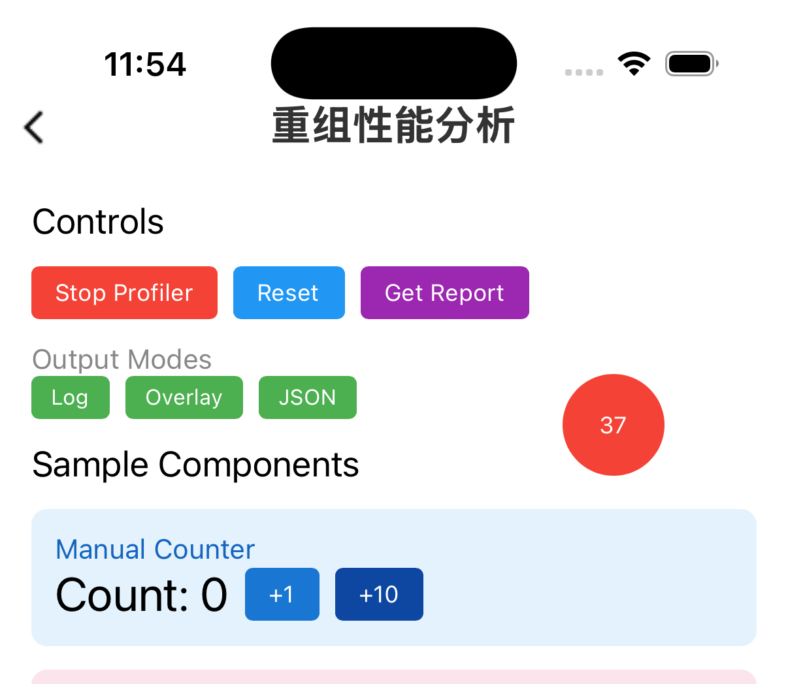
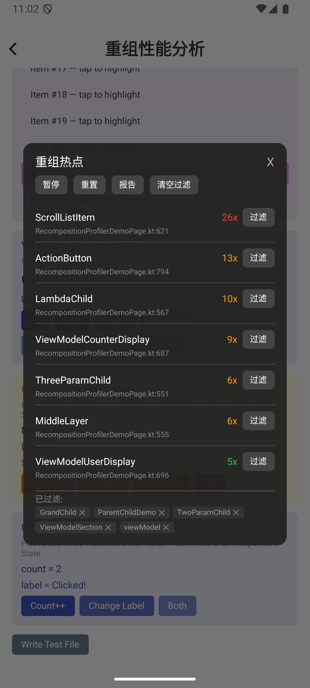

# 重组性能分析工具

本页说明如何使用 Kuikly Compose 内建的 `RecompositionProfiler` 工具，在调试阶段定位重组性能问题。

**主要能力：**
- 自动追踪所有 Composable 的重组次数与耗时（无需修改业务代码）
- 精确显示触发重组的 State 对象及其值变化（`prev → now`）
- 检测参数级变更（哪个参数导致了本次重组）
- 悬浮热点面板（Overlay），实时可视化重组热点
- 自定义过滤：按名称或包名前缀排除业务基础组件，聚焦核心业务逻辑
- 自动写文件（JSON 报告 + 逐帧数据），供 AI 离线分析
- 多平台一致：iOS、Android、HarmonyOS 行为相同

---

## 快速开始

### 1. 启动 Profiler

```kotlin
// 配置（可选，不调用则使用默认配置）
RecompositionProfiler.configure {
    sampleRate = 1.0f          // 采样率，1.0 = 全量采集
    hotspotThreshold = 10      // 热点阈值
    enableLog = true           // 默认 true，开启日志输出
    enableFile = true          // 默认 true，开启文件写入，供 AI 离线分析
    enableOverlay = true       // 启用悬浮热点面板（默认 false）
}

// 启动
RecompositionProfiler.start()
```

> **默认行为**：`start()` 后自动开启日志输出（`enableLog = true`）和文件写入（`enableFile = true`），文件写入用于 AI 离线分析重组问题，无需手动配置。

### 2. 获取报告

```kotlin
// 获取结构化报告（Profiler 运行中或 stop 后均可调用）
// saveToFile=true（默认）会同时将报告写入 profiler_report.json
val report = RecompositionProfiler.getReport()

// 输出 JSON
println(report.toJson())
```

### 3. 停止 Profiler

```kotlin
RecompositionProfiler.stop()
// stop 后自动写 profiler_report.json，仍可调用 getReport() 获取数据
```

### 4. 重置数据

```kotlin
RecompositionProfiler.reset()
```

清空当前会话内所有已采集的重组数据（帧事件、组件统计、State 变更记录），计数从零重新开始。适合在切换测试场景时使用，Profiler 保持运行状态不中断。

---

## 自定义过滤

业务项目中通常有大量基础组件（如通用按钮、Loading 组件等）频繁重组，这些噪声会干扰对核心业务逻辑的分析。通过自定义过滤，可以将指定组件从面板和日志中排除，聚焦真正需要关注的重组。

### 按名称精确排除

```kotlin
// 排除指定 Composable（追加语义，不替换已有规则）
RecompositionProfiler.excludeByName("MyBaseButton", "CommonLoading")

// 也支持 List 传参
RecompositionProfiler.excludeByName(listOf("MyBaseButton", "CommonLoading"))
```

### 按包名前缀批量排除

```kotlin
// 排除某个包下的所有 Composable
RecompositionProfiler.excludeByPrefix("com.myapp.foundation.", "com.myapp.common.")
```

### 清空过滤规则

```kotlin
// 清空所有业务自定义过滤规则（内置框架过滤不受影响）
RecompositionProfiler.clearCustomFilters()
```

### 配置时机

过滤规则可在 `start()` 前后任意时刻配置，立即生效：

```kotlin
// 方式一：start 前配置，从第一帧起就过滤
RecompositionProfiler.excludeByName("MyWidget")
RecompositionProfiler.start()

// 方式二：运行中动态添加
RecompositionProfiler.start()
// ... 观察一段时间后 ...
RecompositionProfiler.excludeByName("NoisyComponent")
```

### 规则持久性

- **stop/start 跨 session**：过滤规则在 `stop()` 后保留，下次 `start()` 仍生效
- **幂等**：重复添加同一名称无副作用（Set 语义）
- **空字符串**：会被自动忽略

---

## 输出格式

### 日志格式

日志 Tag 为 `RCProfiler`，每行单独输出，可用此 Tag 过滤所有重组日志：

```bash
# Android
adb logcat -s "RCProfiler"

# iOS 控制台（console.log）
grep "RCProfiler" logs/kuikly_console.log

# HarmonyOS
grep "RCProfiler" logs/kuikly_ohos.log
```

每帧只要发生重组就输出一个 Frame 块（无重组的帧不输出），每行独立带 Tag：

```
[RCProfiler] Frame #42 START (ts=1774431764564ms)
[RCProfiler]   RECOMPOSED: CounterSection @RecompositionProfilerDemoPage.kt:221 (1ms) [parent=<unknown>] params=[no params change] triggers=[State(prev=1, now=2), readers: CounterSection]
[RCProfiler]   RECOMPOSED: LambdaChild @RecompositionProfilerDemoPage.kt:331 (0ms) [parent=ParentChildDemo] params changed: [#1] (1/2) triggers=[]
[RCProfiler] Frame #42 END (duration=5ms, recomposed=2)
```

**字段说明：**

| 字段 | 说明 |
|------|------|
| `Frame #N` | 帧序号，从 1 开始累计递增（包含无重组的帧），相邻输出的帧号可能不连续，属正常现象 |
| `@File.kt:Line` | Composable 函数的源码**声明**位置（编译器限制，不是调用位置） |
| `(Xms)` | 本次重组耗时 |
| `params=[no params change]` | 参数未变化，重组由 State 变化触发 |
| `params changed: [#1]` | 第 1 号参数发生变化（父组件传入新值） |
| `triggers=[State(prev=1, now=2)]` | 触发此次重组的 State 及值变化 |
| `readers: CounterSection` | 读取该 State 的组件名 |

---

## Overlay 热点面板

启用 `enableOverlay = true` 后，页面右下角出现悬浮圆形按钮，可拖动位置：

|  |  |
|:---:|:---:|
| 悬浮 FAB | 展开热点面板 |

- **正常态**：显示当前会话累计重组次数，绿色（无重组）→ 橙色 → 红色（高频重组）
- **暂停态**：显示 `||`，数据更新暂停但 Overlay 仍可见
- **点击展开**：居中面板展示热点列表

### 热点面板功能

| 按钮 | 功能 |
|------|------|
| 暂停 / 继续 | 暂停或恢复 Overlay 数据更新（不影响底层采集，也不隐藏面板） |
| 重置 | 清空所有计数，等同于 `RecompositionProfiler.reset()`。过滤规则保留不受影响 |
| 报告 | 将完整 JSON 报告输出到控制台日志 |
| 清空过滤 | 清空所有业务自定义过滤规则，等同于 `RecompositionProfiler.clearCustomFilters()` |

### 热点列表说明

- 按**函数名聚合**，同名组件的所有实例合并统计
- 包含首次组合和重组，按总次数降序排列
- 每条显示：组件名（左）、累计次数（右）、源码声明位置（第二行灰色小字）
- 最多展示 `overlayTopCount` 条（默认 10）

> **为什么不按实例区分**：Compose Runtime 的 `traceEventStart` key 是函数维度（非调用点），不同驱动方式（State 失效 vs 参数驱动）下实例 key 的可用性不一致，强行区分会导致部分组件有序号、部分没有，行为不统一。实例级细节可通过日志的 `RECOMPOSED` 输出（含 `parent` 信息）查看。

---

## 配置项说明

| 配置项 | 类型 | 默认值 | 说明 |
|--------|------|--------|------|
| `sampleRate` | Float | `1.0` | 采样率（0.0～1.0）。`0.5` 表示约 50% 的帧被记录，可降低性能开销 |
| `hotspotThreshold` | Int | `10` | 热点判定阈值：Report 中 `isHotspot = true` 的判定条件 |
| `maxEventBufferSize` | Int | `100000` | 事件缓冲区最大容量，超出时丢弃最旧事件 |
| `includeFrameworkComposables` | Boolean | `false` | 是否包含框架内部 Composable（Row/Column 等）。默认只监控业务代码 |
| `enableBuiltinFilters` | Boolean | `true` | 是否启用内置框架过滤。关闭后框架 Composable 也会被记录 |
| `customFilters` | List | `[]` | 静态自定义过滤器列表（实现 `ComposableFilter` 接口）。与 `excludeByName`/`excludeByPrefix` 共存互不覆盖 |
| `enableLog` | Boolean | `true` | 是否开启日志输出。仅在 start/stop 期间有效 |
| `enableFile` | Boolean | `true` | 是否开启文件写入，供 AI 离线分析。仅在 start/stop 期间有效 |
| `enableOverlay` | Boolean | `false` | 启用悬浮热点面板。需在 `start()` 前设置 |
| `overlayTopCount` | Int | `10` | 热点面板展示的最大条目数 |

---

## 注意事项

- **性能**：Profiler OFF 时零开销（编译器注入的 trace 调用被短路）。建议只在开发/测试包中启用，不要在生产包中 `start()`。
- **数据范围**：`RecompositionProfiler` 是全局单例，`start()` 后所有页面的重组都会被采集，多页面跳转时数据累积在一起。如需按页面分析，建议在进入目标页面时 `reset()`。
- **Overlay 开关**：`enableOverlay` 需要在 `start()` 之前通过 `configure { }` 设置。
- **采样率**：高频重组场景（如 60fps 动画）可设置 `sampleRate = 0.3` 降低日志量。
- **文件位置**：写入 App 沙盒目录（iOS/Android 写 Caches，HarmonyOS 写 files），系统磁盘紧张时 Caches 可能被清理；分析完建议及时备份。
