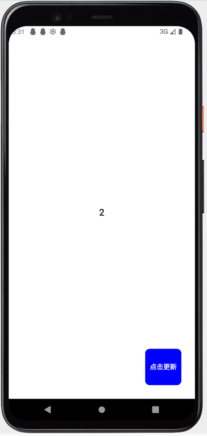

# UI响应式更新

在客户端原生开发中，我们更新UI的步骤通常为：
1. 更新数据
2. 拿到``View``引用
3. 将数据设置给``View``

而在``Kuikly``中，我们可省掉这些步骤，**只专注于数据的更新**，``KuiklyCore``会负责帮你将数据更新到``UI``。举个例子：

::: tabs

@tab:active 示例

```kotlin
@Page("HelloWorldPage")
internal class HelloWorldPage : Pager() {

    private var counter by observable(0)

    override fun body(): ViewBuilder {
        val ctx = this
        return {
            attr {
                backgroundColor(Color.WHITE)
                justifyContentCenter()
                alignItemsCenter()
            }

            Text {
                attr {
                    text(ctx.counter.toString())
                    fontSize(20f)
                    fontWeightBold()
                }
            }

            Button {
                attr {
                    absolutePosition(bottom = 30f, right = 30f)
                    size(80f, 80f)

                    borderRadius(10f)
                    backgroundColor(Color.BLUE)

                    titleAttr {
                        text("点击更新")
                        fontSize(15f)
                        color(Color.WHITE)
                        fontWeightBold()
                    }
                }

                event {
                    click {
                        ctx.counter++
                    }
                }
            }
        }
    }
}
```

@tab 效果

<div align="center">

</div>

:::

在这个例子中，含有一个居中的Text组件和右下角有一个Button组件。在Text组件中，我们将``counter``变量的值设置给Text组件，
然后我们监听了Button组件的click事件，并在click事件触发的时候，对``counter``变量进行累加，每次累加的时候，你会发现Text的文本会自动更新。

## 响应式字段observable<``T``>

在上述例子中，为什么Text组件的文本会自动更新呢? 答案是Text组件的text属性绑定了一个响应式字段``counter``。
``counter``字段与普通的变量不一样，它通过``by observable``代理，将字段变成一个响应式字段, 这样当响应式字段被设置到组件的属性后, 每次响应式字段更新时, 依赖该字段的属性都会自动更新，
从而到达UI属性响应式更新的目的。

<br/>

在``Kuikly``中，你可以通过``by observable<``T``>``将一个字段变成响应式字段，然后绑定到UI组件的属性，这样UI组件的属性就能自动监听数据变化而自动更新, 例如:

```kotlin
private var counter by observable(0)
```

## 响应式容器observableList<``T``>()和observableSet<``T``>()

在``Kuikly``中，响应式字段可分为两类
1. **单值类型**: ``observable<T>()``
2. **容器类型**: ``observableList<T>()``, ``observableSet<T>()``

其中``observableList``和``observableSet``为响应式容器, 常用于结合``vfor``语句来用来循环创建列表下的Item, 并且当往响应式容器添加数据时, 列表能够自动新建Item。

举个例子:

::: tabs

@tab:active 示例

```kotlin{4,26}
@Page("HelloWorldPage")
internal class HelloWorldPage : Pager() {

    private var list by observableList<String>()

    override fun created() {
        super.created()
        // mock data
        for (i in 0 until 10) {
            list.add(i.toString())
        }
    }

    override fun body(): ViewBuilder {
        val ctx = this
        return {
            attr {
                backgroundColor(Color.WHITE)
            }

            List {
                attr {
                    flex(1f)
                }

                vfor({ ctx.list }) { item ->
                    View {
                        attr {
                            flexDirectionRow()
                            margin(20f)
                        }

                        Text {
                            attr {
                                text(item)
                                fontSize(20f)
                                fontWeightBold()
                            }
                        }

                        Image {
                            attr {
                                marginLeft(20f)
                                size(50f, 50f)
                                src("https://vfiles.gtimg.cn/wupload/xy/componenthub/TbyiIqBP.jpeg")
                            }
                        }
                    }
                }
            }
        }
    }
}
```

@tab 效果

<div align="center">

</div>

:::

在上面的例子中，我们先通过by observableList<``T``>声明了一个响应式容器, 并在``List``组件下将容器绑定在``vfor``语句的闭包中, 让List的列表具有自动更新的能力。
例如，一开始我们往数据list容器添加10个数据，因此当开始运行的时候，``List``组件下会有10个Item。当我们在运行时的某个时刻往数据list中再添加一个数据，此时你会发现List组件会自动创建第11个Item。

## 常见错误

### 错误1：在属性设置中未引用响应式字段

如果属性设置中没有直接引用响应式字段，而是将值提前取出存储到普通变量中，则该属性不会响应数据变化。

```kotlin
// 错误示例
private var textContent by observable("Hello")

override fun body(): ViewBuilder {
    val ctx = this
    val content = ctx.textContent // 错误：提前取值，断开了响应式依赖
    return {
        Text {
            attr {
                text(content) // 错误：使用普通变量，不会响应ctx.textContent的变化
            }
        }
    }
}

// 正确示例
private var textContent by observable("Hello")

override fun body(): ViewBuilder {
    val ctx = this
    return {
        Text {
            attr {
                text(ctx.textContent) // ✅ 直接引用响应式字段
            }
        }
    }
}
```

### 错误2：修改拥有响应式字段的类实例而非响应式字段本身
响应式系统只能监听响应式字段本身的赋值操作，如果你修改的是对象的内部属性（或者拥有响应式字段的类实例），UI不会自动更新。

```kotlin
class Obj1(field: String) {
    var field: String = field
}
class Obj2(scope: PagerScope, field: String) {
    var field by scope.observable(field)
}
internal class DebugPage : BasePager() {
    var obj1 = Obj1("")
    var obj2 = Obj2(this, "")
    var observableObj1 by observable(Obj1(""))
    var observableObj2 by observable(Obj2(this, ""))

    override fun body(): ViewBuilder {
        val ctx = this
        return {
            Text { attr { text(ctx.obj1.field) } }
            Text { attr { text(ctx.obj2.field) } }
            Text { attr { text(ctx.observableObj1.field) } }
            Text { attr { text(ctx.observableObj2.field) } }
            Button {
                event {
                    click {
                        // ❌错误：field不是响应式字段，不会触发更新
                        ctx.obj1.field = "change"
                        // ❌错误：obj1不是响应式字段，不会触发更新
                        ctx.obj1 = Obj1("change")
                        // ✅正确：field是响应式字段，可以更新
                        ctx.obj2.field = "change"
                        // ❌错误：obj2不是响应式字段，不会触发更新
                        ctx.obj2 = Obj2(ctx, "change")
                        // ❌错误：改变响应式元素内部字段，不会触发更新
                        ctx.observableObj1.field = "change"
                        // ✅正确：observableObj1是响应式字段，可以更新
                        ctx.observableObj1 = Obj1("change")
                        // ⚠️正确：field是响应式字段，可以更新，但observableObj2声明为响应式元素是多余的
                        ctx.observableObj2.field = "change"
                        // ⚠️正确：observableObj2是响应式字段，可以更新，但内部字段声明为响应式是多余的
                        ctx.observableObj2 = Obj2(ctx, "change")
                    }
                }
            }
        }
    }
}
```

## 高效更新列表：diffUpdate

``observableList``提供了``diffUpdate``方法，用于高效地用新列表替换旧列表数据。相比``clear()``+``addAll()``会销毁所有Item后重建，``diffUpdate``基于diff算法只执行必要的增删操作，性能更优。

### 方法签名

```kotlin
fun diffUpdate(newList: List<T>, areItemsTheSame: ((T, T) -> Boolean)? = null)
```

### 参数说明

| 参数 | 类型 | 说明 |
|------|------|------|
| newList | List\<T\> | 新的列表数据 |
| areItemsTheSame | ((T, T) -> Boolean)? | 可选，判断两个元素是否相同的比较函数，默认使用 `==` |

### 使用示例

```kotlin
// 基本用法
list.diffUpdate(newData)

// 自定义比较（适用于复杂对象，如通过id判断是否同一元素）
userList.diffUpdate(newUsers) { old, new -> old.id == new.id }
```

## 手动绑定表达式监听：bindValueChange

`observable` 是字段级的响应式，适用于「字段 → 组件属性」的绑定。当需要监听的是**一段表达式**（而非单个字段）时，可以使用 `Pager.bindValueChange`：它会在表达式依赖的任意响应式字段变化时回调，并在绑定时**立即执行一次**。

```kotlin
fun bindValueChange(
    valueBlock: () -> Any,
    byOwner: Any,
    valueChange: (value: Any) -> Unit
)

fun unbindAllValueChange(byOwner: Any)
```

用法示例：

```kotlin
internal class DemoPage : BasePager() {

    private var firstName by observable("")
    private var lastName by observable("")

    override fun created() {
        super.created()
        // 监听表达式而非单个字段，绑定时会立即回调一次
        bindValueChange(
            valueBlock = { "${firstName} ${lastName}" },
            byOwner = this
        ) { fullName ->
            // 表达式结果变化时触发
            KLog.i("DemoPage", "fullName = $fullName")
        }
    }

    override fun pageWillDestroy() {
        super.pageWillDestroy()
        // 解除该 owner 的全部监听，避免泄漏
        unbindAllValueChange(this)
    }
}
```

::::tip 与 observable 的区别
`observable` 绑定的是字段本身，属性随字段变化自动更新；`bindValueChange` 绑定的是任意表达式，适合需要在数据变化时执行副作用（如发请求、打点、联动赋值）的场景。
::::

## 响应式与线程校验（调试用）

Kuikly 提供了两个校验开关，用于在开发阶段发现「在非 UI 线程访问响应式字段」与「越权访问响应式字段」这两类问题，默认均关闭。

| 开关 | 说明 | 默认值 |
| -- | -- | -- |
| `Pager.VERIFY_THREAD` | 校验响应式字段是否在上下文线程访问 | false |
| `Pager.VERIFY_REACTIVE_OBSERVER` | 校验是否存在越权的响应式访问 | false |
| `Pager.verifyFailed(handler)` | 校验失败时的处理回调 | 默认直接抛出异常 |

用法示例：

```kotlin
// 建议仅在调试包中开启
Pager.VERIFY_THREAD = true
Pager.VERIFY_REACTIVE_OBSERVER = true

// 校验失败时默认会抛出异常，可替换为打印或上报，便于定位调用栈
Pager.verifyFailed { e ->
    KLog.e("KuiklyVerify", e.message ?: "verify failed")
}
```

::::warning 使用建议
校验会带来额外开销，**不要在生产包开启**。排查「UI 不更新」「数据错乱」类问题时，可临时开启以确认是否存在跨线程写响应式字段的情况。
::::

## 下一步

在这节中，我们学习了如何使用响应式字段和响应式容器来达到UI自动更新的目的。下一步，我们来学习``Kuikly``中的[语句指令](directive.md)
