# Quick Start — Write Your First Kuikly Page (Hello World)

> Audience: external developers who have never used Kuikly. Goal: get a runnable
> cross-platform "Hello World" page on Android / iOS / HarmonyOS / H5 / Mini Program
> in ~10 minutes, starting from a freshly scaffolded Kuikly KMP project.

:::tip Note
Before you begin, make sure you have completed the **Kuikly environment setup**.
If not, follow the [Environment Setup guide](env-setup.md) first.
:::

## 1. Create a Kuikly project

Use Android Studio with the Kuikly scaffold plugin to create a KMP project that
already contains Kuikly:

**File → New → New Project → Kuikly Project Template**

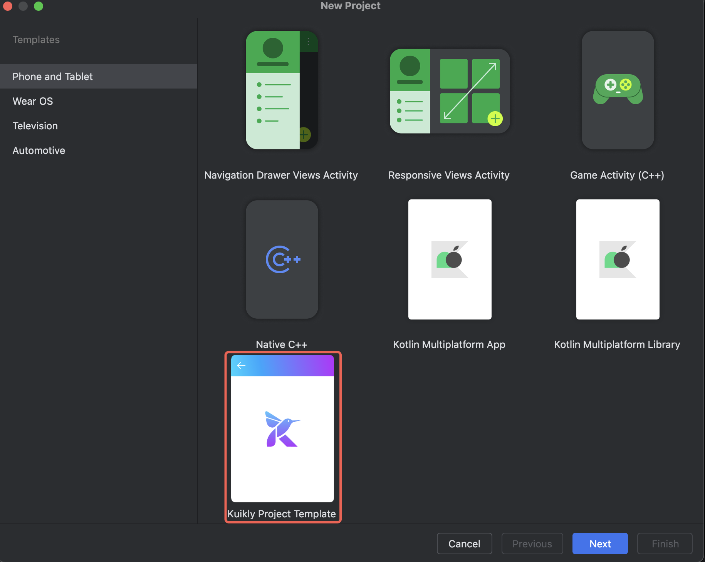

After creation the project auto-builds. Common issues and fixes:

| Symptom | Fix |
| --- | --- |
| Gradle dependency install fails | Use Gradle **7.x** (e.g. 7.5.1). `File → Project Structure → Project → Gradle Version`. If Gradle < 7.4.1, add `enableFeaturePreview("VERSION_CATALOGS")` to root `settings.gradle.kts`. |
| `pod` not found | Follow [Environment Setup](env-setup.md); or comment out iOS build logic ([skip iOS build](env-setup.md#skip-ios-build)). |
| No run configuration | Usually caused by a prior failure; resolve the error then re-sync. |

:::tip Check versions
After creating the project, set the Kuikly version to the latest in:
- business module: `shared/build.gradle.kts`
- Android shell: `androidApp/build.gradle.kts`
- iOS shell: `iosApp/Podfile`
- HarmonyOS shell: `ohosApp/entry/oh-package.json5`

All platforms must use the **same** version. Since Kuikly **2.5.0** the Maven
source moved — add `maven("https://mirrors.tencent.com/nexus/repository/maven-tencent/")`.
See the [ChangeLog](../ChangeLog/changelog.md) for the latest version.
:::

## 2. Run the shell apps

### Android
1. Select the `androidApp` configuration and **Run 'androidApp'**.

   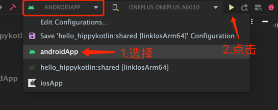

2. When this screen appears, the app runs successfully:

   <div align="center">
   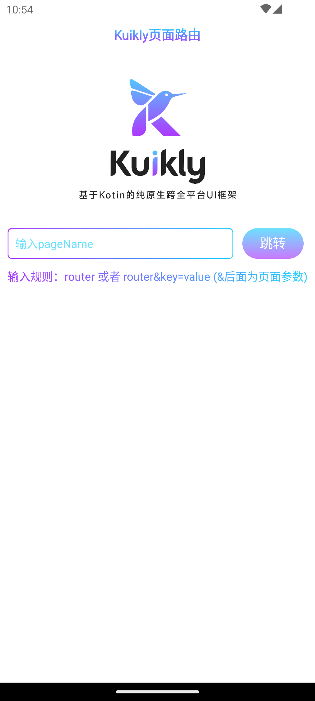
   </div>

### iOS
1. First run only — `cd iosApp` and execute `pod install --repo-update`.
2. Select `iosApp` in the toolbar; pick a device/simulator on the left.
3. **Run 'iosApp'**.

   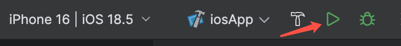

4. Success screen:

   <div align="center">
   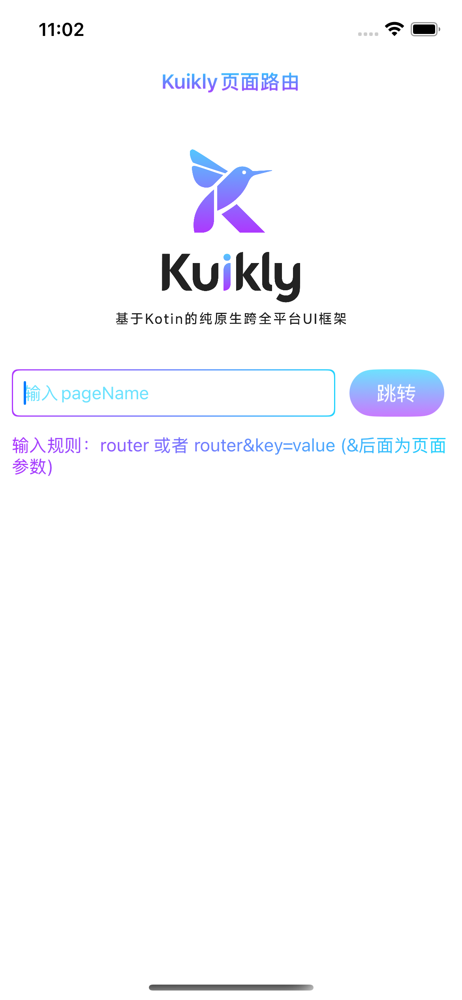
   </div>

:::tip iOS script permission
The iOS shell runs a KMP script at compile time. If you hit a file read/write
permission error, set `User Script Sandboxing` to `No` in
`Xcode → Build Setting`.
:::

### HarmonyOS
1. Open `ohosApp` in DevEco Studio (if first sync fails, open `.npmrc` and click
   sync in the top-right).
2. Sign before running: `File → Project Structure → Signing Configs`.
3. Run `ohosApp` from DevEco Studio or Android Studio.

   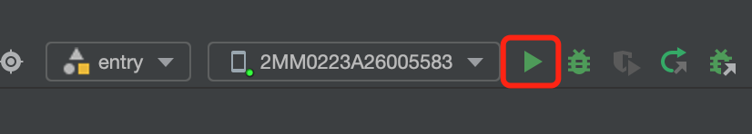
   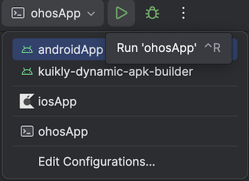

4. Success screen:

   <div align="center">
   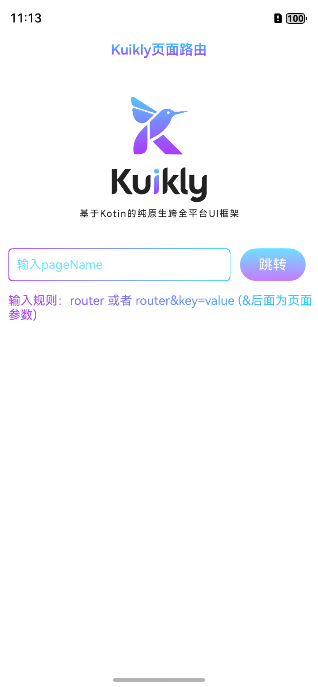
   </div>

:::tip HarmonyOS notes
- Ohos cross-platform artifacts can be built on Windows — see
  [HarmonyOS dev guide](../DevGuide/harmony-dev.md/#windows-build-config).
- Use plugin **≥ 1.1.0** to scaffold an Ohos project from the plugin.
- The HarmonyOS emulator is not supported on X86 Macs; use Apple Silicon (Arm) Macs.
:::

### H5 (Web)
H5 runs via a Gradle dev-server:

```shell
# start the demo dev server (run `npm install` first if deps are missing)
npm run serve
# build the shared (business) module Debug bundle
./gradlew :shared:packLocalJsBundleDebug
# build & serve the h5App (Kotlin 2.0+: jsBrowserDevelopmentRun)
./gradlew :h5App:jsBrowserRun -t
# copy assets into the dev server
./gradlew :h5App:copyAssetsToWebpackDevServer
```

Open http://localhost:8080/ . Append `?page_name=<page>` to open a specific page,
e.g. http://localhost:8080/?page_name=router .

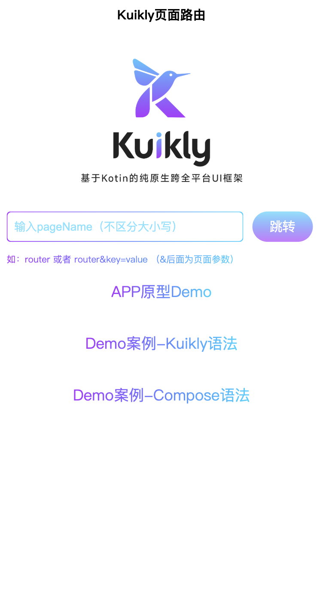

### Mini Program (WeChat)
Compile to JS via Gradle, then run in WeChat DevTools:

```shell
# build the shared (business) module Debug bundle
./gradlew :shared:packLocalJsBundleDebug
# build & serve the miniApp dev bundle
./gradlew :miniApp:jsMiniAppDevelopmentWebpack
```

Release build:

```shell
./gradlew :demo:packLocalJSBundleRelease
./gradlew :miniApp:jsMiniAppProductionWebpack
```

Open the `miniApp/dist` directory in WeChat DevTools, adjust the `pages` array in
`app.json`, and create the corresponding page files. Success screen:

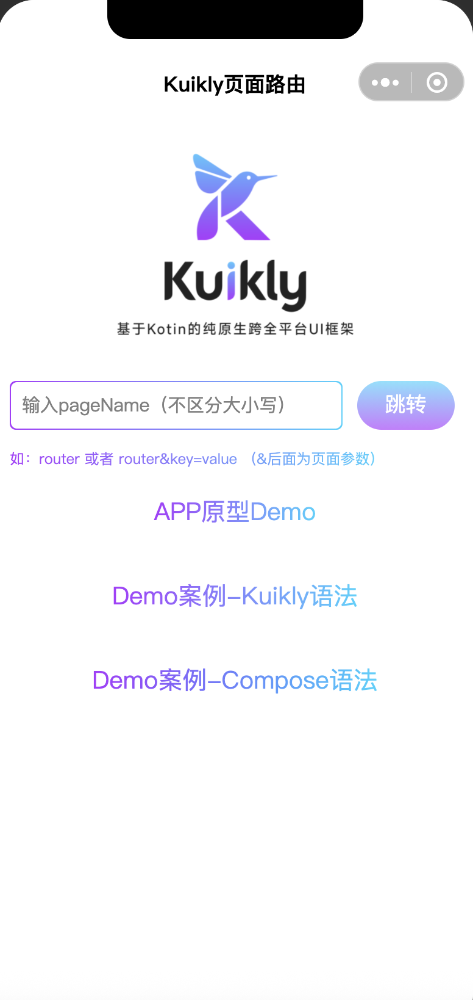

## 3. Write the Hello World page

Now write the classic `Hello Kuikly` page in Kotlin.

1. Under `shared/src/commonMain/kotlin/<your.package>/`, create a `pages`
   directory and add a `HelloWorldPage` class.
2. Make it inherit from `Pager` and override `body()`.
3. Use the DSL to build a centered `Text`.

```kotlin
@Page("HelloWorld")
internal class HelloWorldPage : Pager() {

    override fun body(): ViewBuilder {
        return {
            attr {
                allCenter()           // center children both axes
            }

            Text {
                attr {
                    text("Hello Kuikly")
                    fontSize(14f)
                }
            }
        }
    }
}
```

Key points:

- `@Page("HelloWorld")` registers the page under the name `HelloWorld`. Kuikly
  looks pages up by this name at runtime — keep it unique per project.
- `body()` returns a `ViewBuilder` (the `{}` lambda). Call components like
  `Text { ... }` inside it.
- `attr { ... }` sets layout/styling on the current node. `allCenter()` centers
  its children; `text(...)` / `fontSize(...)` configure the `Text`.

> Prefer deriving from your project's base pager (e.g. `BasePager`) when one
> exists — it typically wires up a default navbar and shared adapters. The
> `demo` module uses `BasePager`; a minimal `Pager` is shown above for clarity.

## 4. Run it

Use Android as the demo target:

1. Run `androidApp`.
2. On the **Kuikly routing page**, enter the `@Page` name `HelloWorld` and tap
   to jump.

   <div align="center">
   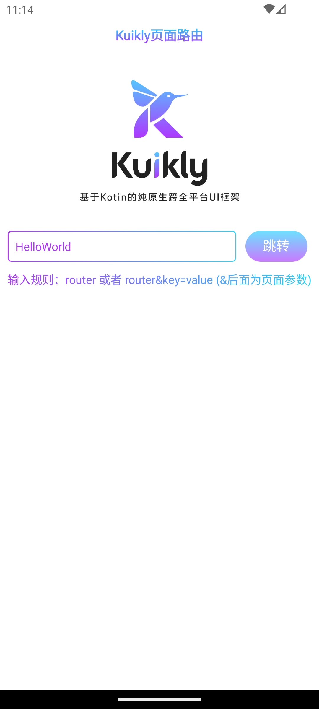
   </div>

3. Result:

   <div align="center">
   
   </div>

The same `HelloWorldPage` runs unchanged on iOS, HarmonyOS, H5, and Mini Program
— that is the "one codebase, six platforms" promise.

## 5. More examples

The `demo` module in the Kuikly source root ships rich, runnable demos (compile
the source first, then run each platform's shell app):

- **App prototype demo** — end-to-end UI flows.

  <div align="center">
  
  </div>

- **Component demos** — per-component styles & attributes.

  <div align="center">
  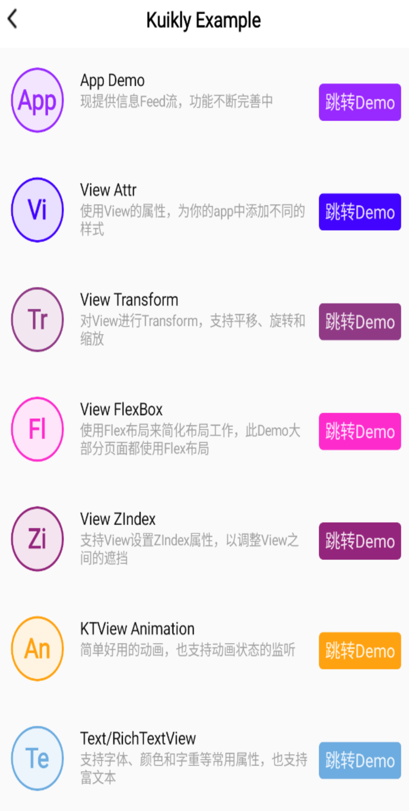
  </div>

## Next steps

- If Kuikly is **not yet integrated** into your app, see
  [Kuikly Integration Overview](./overview.md) to wire the renderer into each platform.
- If already integrated, start from the
  [Pager concept](../DevGuide/pager.md) and continue with the tutorials.
- Per-platform renderer integration:
  1. [Android](android.md)
  2. [iOS](iOS.md)
  3. [HarmonyOS](harmony.md)
  4. [H5](h5.md)
  5. [Mini Program](Miniapp.md)
